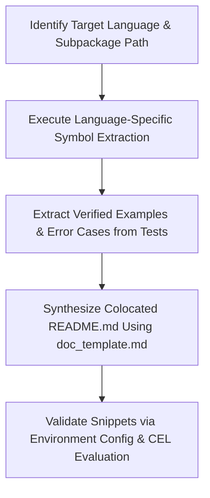

# CEL Library Documentation Generator Skill

Use this skill to inspect CEL (Common Expression Language) extension libraries in **Go**, **C++**, or **Java** and generate or update a comprehensive `README.md` written from the perspective of that specific language implementation, matching the canonical format established in `third_party/cel/go/ext/README.md`.

---

## 1. Overview & Documentation Colocation Rules

Each CEL repository (`cel-go`, `cel-cpp`, `cel-java`) maintains extension documentation tailored to its language runtime.

### Colocation Rule

*   **Subpackage Documentation**: If a library is implemented in its own subpackage or subdirectory (e.g., `cel-go/ext`, `cel-go/ext/security/hmac`, `cel-cpp/extensions`, `cel-java/extensions`), the documentation **MUST be colocated** directly in that subpackage's directory (e.g., `ext/README.md`, `ext/security/hmac/README.md`, `extensions/README.md`).
*   **Root Package Documentation**: The top-level `ext/README.md` is reserved strictly for extension functions declared directly in the root `ext/` directory (e.g., `ext/math.go`, `ext/strings.go`, `ext/encoders.go`).

A colocated library `README.md` documents:

*   **Enablement**: How to configure and register the extension using that language's environment or compiler builder API.
*   **CEL Declarations**: The functions, overloads, macros, and native types exposed by the library.
*   **Signatures & Semantics**: The standard CEL type signatures, parameter constraints, and edge-case behavior.
*   **Verified Examples**: Concrete CEL expressions extracted directly from unit test suites with their expected return values and error conditions.

---

## 2. End-to-End Workflow

Follow this workflow when pointed at a library directory or source package:



1.  **Select Target Language & Path**: Determine whether the library is in Go, C++, or Java, and identify its colocated directory.
2.  **Run Symbol Extraction**: Follow the language-specific extraction protocol (Section 3) to extract the enablement API, function overloads, macro registrations, custom types, and version tags.
3.  **Extract Test Cases**: Inspect corresponding test files to obtain verified CEL expressions and expected outputs or error messages.
4.  **Populate Colocated `README.md`**: Render the extracted data into `README.md` located in the library's directory following [references/doc_template.md](references/doc_template.md).
5.  **Test Documentation Snippets**: Validate all code snippets using the `cel-expr-mcp` tools (`cel_create_environment`, `cel_compile`, `cel_evaluate`) guided by the [cel-authoring](../cel-authoring/SKILL.md) and [cel-debugging](../cel-debugging/SKILL.md) skills (Section 4).

---

## 3. Language-by-Language Symbol Extraction Protocol

### 3.1 Go (`cel-go`)

#### A. Locate Package Files

Search under the library's colocated directory (e.g. `ext/security/jwt/jwt.go`, `ext/security/jwt/jwt_test.go`, `ext/security/hmac/hmac.go`, `ext/security/hmac/hmac_test.go`).

#### B. Extract Enablement API
*   **Entrypoint Function**: Look for exported functions returning `cel.EnvOption` or `cel.Library`:
    *   `func Library(options ...Option) cel.EnvOption` (e.g., `jwt.Library()`, `hmac.Library()`)
    *   `func <Name>(...) cel.EnvOption` (e.g., `ext.Strings()`, `ext.Bindings()`)
*   **Module Path**: Determine the Go import path (e.g. `"cel.dev/cel-go/ext/security/jwt"`).
*   **Enablement Snippet**:
    ```go
    env, err := cel.NewEnv(jwt.Library())
    ```

#### C. Extract CEL Functions & Overloads

Inspect `cel.Function(...)` definitions:

*   **Function Name**: First argument to `cel.Function("name", ...)` (e.g. `"jwt.parse"`, `"claim"`, `"presentedBy"`, `"hmac.compute"`, `"hmac.verify"`).
*   **Global Overloads**: `cel.Overload(overloadID, []*cel.Type{paramTypes...}, resultType, ...)` -> Signature: `<namespace>.<func>(<param1>, <param2>) -> <result>`
*   **Member Overloads**: `cel.MemberOverload(overloadID, []*cel.Type{receiverType, paramTypes...}, resultType, ...)` -> Signature: `<receiver>.<func>(<param1>) -> <result>`
*   **Optional Chaining Overloads**: When a member overload is registered for both `<T>` and `<optional(T)>` (e.g., `<jwt.Token>.claim(<string>)` and `<optional(jwt.Token)>.claim(<string>)`), list both overloads in the signature block.
*   **Type Mapping**:
    *   `cel.IntType` -> `<int>`
    *   `cel.UintType` -> `<uint>`
    *   `cel.DoubleType` -> `<double>`
    *   `cel.StringType` -> `<string>`
    *   `cel.BytesType` -> `<bytes>`
    *   `cel.BoolType` -> `<bool>`
    *   `cel.DynType` / `cel.AnyType` -> `<dyn>`
    *   `cel.ListType(T)` -> `<list(T)>`
    *   `cel.MapType(K, V)` -> `<map(K, V)>`
    *   `cel.OptionalType(T)` -> `<optional(T)>`

#### D. Extract Native Custom Types & Fields

Inspect `types.NewNativeType` or `types.NewObjectType` registrations:

*   When a native Go struct is registered with `types.ParseStructTag("cel")` (e.g. `jwt.Token`), inspect the struct fields and their `cel:"<name>"` tags.
*   Document each field with its name and CEL type in the `### <TypeName>` section.

#### E. Extract CEL Macros

Inspect `cel.Macro` declarations:

*   `cel.GlobalVarArgMacro(name, minArgs, expander)`
*   `cel.ReceiverMacro(name, argCount, expander)`
*   `cel.ReceiverVarArgMacro(name, expander)`

#### F. Extract Verified Examples from Go Tests

Read `*_test.go`:

*   Look for table-driven test cases (e.g. `tests := []struct { expr string; want any; err string }`).
*   Extract valid expressions and format return comments:
    ```
    jwt.parse(tokenStr).hasValue() // true
    hmac.verify(hmac.SHA256, secret, msg, sig) // true
    ```
*   Extract negative test cases for errors:
    ```
    jwt.parse('invalid.token') // error
    ```

---

### 3.2 C++ (`cel-cpp`)

#### A. Locate Header and Source Files

Search under `extensions/<lib>/` or `extensions/`.

#### B. Extract Enablement API

*   **Compiler Library**: Look for classes derived from `cel::CompilerLibrary` or factory functions (e.g., `CompilerBuilder::AddLibrary(<Name>CompilerLibrary())`).
*   **Runtime Library**: Look for functions registering runtime functions (e.g., `Register<Name>Functions(FunctionRegistry* registry)`).
*   **Include Directive**: `#include "extensions/<lib>.h"`

#### C. Extract CEL Functions & Overloads

Inspect calls in `extensions/<lib>.cc`:

*   `cel::FunctionDecl::Create(...)`
*   `cel::OverloadDecl::Create(...)`
*   Extract function name, receiver vs global overload, argument types, and return types using C++ `cel::Type` helpers.

#### D. Extract Macros & Tests

*   Macros: `cel::Macro::Receiver(...)`, `cel::Macro::Global(...)`.
*   Tests: Extract expressions from `*_test.cc` (`EXPECT_THAT(eval_result, IsOkAndHolds(...))`).

---

### 3.3 Java (`cel-java`)

#### A. Locate Package Files

Search under `extensions/src/main/java/dev/cel/extensions/<lib>/` or `CelExtensions.java`.

#### B. Extract Enablement API

*   Look for static factory methods on `CelExtensions` (e.g. `CelExtensions.math()`, `CelExtensions.strings()`).

#### C. Extract CEL Functions, Macros & Tests

*   `CelFunctionDecl.newFunctionDeclaration(...)`
*   `CelMacro.newReceiverMacro(...)`, `CelMacro.newGlobalVarArgMacro(...)`
*   Tests: Extract expressions from `*Test.java` (`cel.compile(expr)`, `assertThat(result).isEqualTo(...)`).

---

## 4. Testing Documentation Snippets via CEL Environment Config & MCP Tools

To ensure 100% documentation accuracy, every example expression in the `README.md` must be validated against an active CEL environment using the `cel-expr-mcp` tools alongside the [cel-authoring](../cel-authoring/SKILL.md) and [cel-debugging](../cel-debugging/SKILL.md) skills.

### 4.1 Create & Validate Environment Configuration

Create a JSON/YAML environment configuration file (e.g. `env.json`) declaring the library extension and test variables. Follow the [cel-authoring](../cel-authoring/SKILL.md) skill and call the `cel_create_environment` tool to validate the environment configuration:

```json
{
  "extensions": [
    {
      "name": "math",
      "version": "latest"
    }
  ],
  "variables": [
    { "name": "a", "type": "int" },
    { "name": "b", "type": "int" },
    { "name": "c", "type": "int" }
  ]
}
```

> [!TIP]
> You can also start the `cel-expr-mcp` server with the environment configuration preloaded using the `-env` (or `-environment`) flag:
> ```bash
> cel-expr-mcp -env env.json
> # or pass inline JSON:
> cel-expr-mcp -env '{"extensions":[{"name":"math"}],"variables":[{"name":"a","type":"int"},{"name":"b","type":"int"},{"name":"c","type":"int"}]}'
> ```
> When started with a fixed environment, MCP tool calls (`cel_compile`, `cel_evaluate`, `cel_generate_prompt`) operate directly against this pre-configured environment without requiring `envConfig` in every call payload.

### 4.2 Validate Each Example Expression

For each snippet in the documentation:

1.  **Parse & Compile (`cel_compile`)**: Run the expression through `cel_compile` with the environment configuration. Ensure compilation succeeds without unexpected type or overload errors. If compilation fails, use the [cel-debugging](../cel-debugging/SKILL.md) skill to diagnose and fix errors (such as undeclared references, type mismatches, or missing library extensions).
2.  **Evaluate with Test Inputs (`cel_evaluate`)**: Define test cases providing input variable bindings (e.g., supplying values for all three variables `a`, `b`, and `c`) and the expected result. Run `cel_evaluate` to verify the output matches the documented inline comment:

    ```json
    [
      {
        "testCase": "calculate greatest of three integers",
        "bindings": {
          "a": 10,
          "b": 42,
          "c": 7
        },
        "expected": 42
      }
    ]
    ```

    *   `math.greatest(a, b, c)` with `{a: 10, b: 42, c: 7}` -> evaluates to `42` (`// returns 42`)
    *   `math.least(a, b, c)` with `{a: 10, b: 42, c: 7}` -> evaluates to `7` (`// returns 7`)
    *   `math.greatest([a, b, c])` with `{a: 10, b: 42, c: 7}` -> evaluates to `42` (`// returns 42`)

3.  **Negative & Error Cases**: Verify that documented error expressions (e.g., passing invalid types or empty lists where disallowed) produce expected runtime/check errors via `cel_compile` or `cel_evaluate` rather than unhandled panics, diagnosing unexpected failures with the [cel-debugging](../cel-debugging/SKILL.md) skill.

---

## 5. Synthesis & Quality Checklist

When generating or updating the `README.md`:

1.  **Colocation Check**: Ensure the file is saved in the colocated library subpackage directory (`ext/<pkg>/<lib>/README.md`).
2.  **Format Adherence**: Follow [references/doc_template.md](references/doc_template.md) for section headers, version badges, signature blocks, and example blocks.
3.  **Signature Accuracy**: Ensure all signatures use standardized angle-bracket types (`<int>`, `<string>`, `<list(T)>`, `<map(K, V)>`, `<optional(T)>`, `<dyn>`).
4.  **Namespace Consistency**: If the library uses a prefix (e.g. `jwt.`, `hmac.`), verify all function headings and signature lines match the namespace.
5.  **Verified Output Comments**: Ensure example blocks provide comments showing return values (`// true`, `// return b'hello'`) and error annotations (`// error`).
